# Switchyard — daily dilemma gallery

One algorithmically-composed moral dilemma a day, rendered by the [engine](../). Each is seeded by its date, so every frame is reproducible. 19 dilemmas and counting.

---

### 2026-07-06 — *the bridge, and the saboteur*

 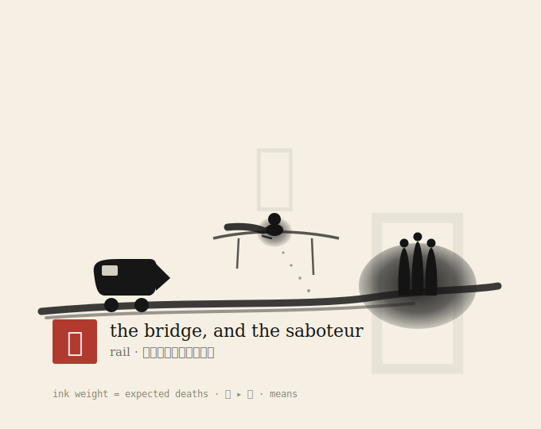

`interpose` · `means` · **contested** · E[deaths]=1 — also [editorial](2026-07-06.editorial.svg) · [animated](2026-07-06.animated.svg) · [hero prompt](2026-07-06.prompt.txt) · `node scripts/gallery.ts 2026-07-06`

---

### 2026-07-05 — *the loop, and a lone stranger*

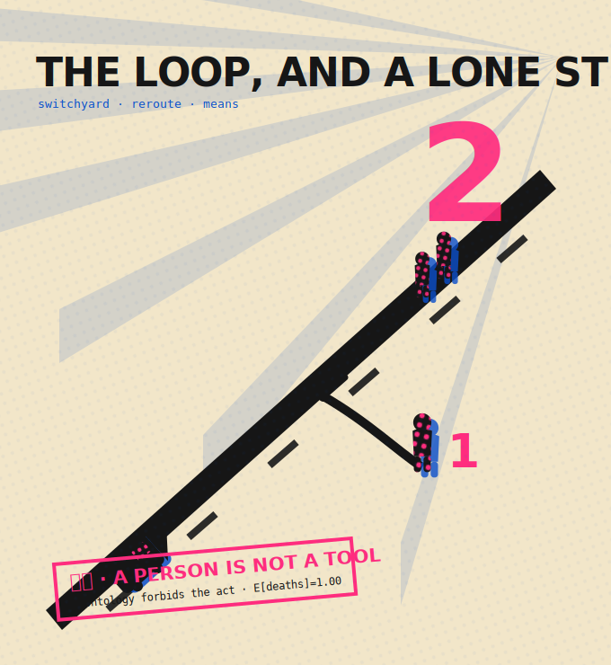 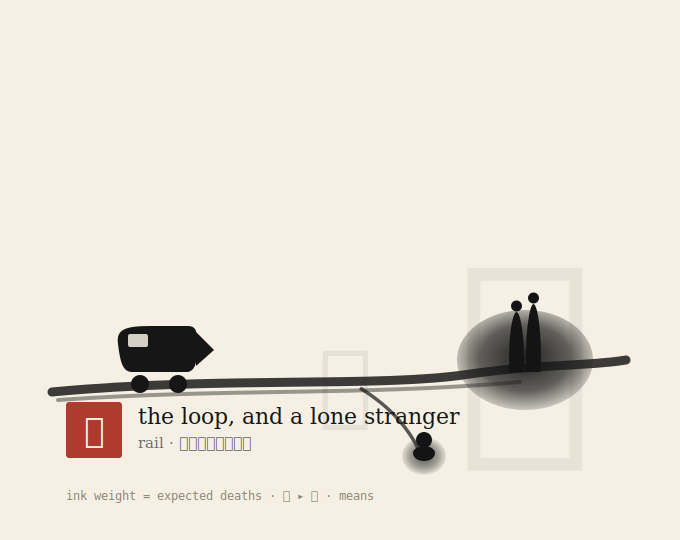

`reroute` · `means` · **contested** · E[deaths]=1 — also [editorial](2026-07-05.editorial.svg) · [animated](2026-07-05.animated.svg) · [hero prompt](2026-07-05.prompt.txt) · `node scripts/gallery.ts 2026-07-05`

---

### 2026-07-04 — *the loop, and the one who chose the risk*

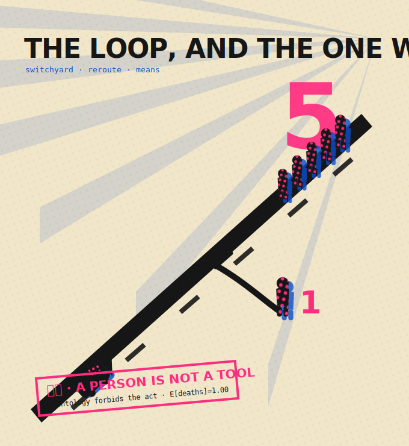 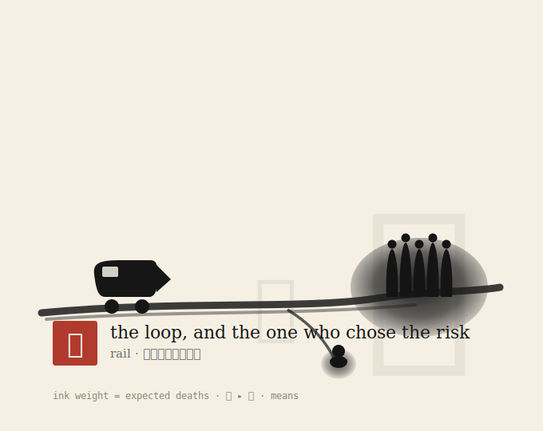

`reroute` · `means` · **contested** · E[deaths]=1 — also [editorial](2026-07-04.editorial.svg) · [animated](2026-07-04.animated.svg) · [hero prompt](2026-07-04.prompt.txt) · `node scripts/gallery.ts 2026-07-04`

---

### 2026-07-03 — *the loop, and the saboteur*

 

`reroute` · `means` · **contested** · E[deaths]=1 — also [editorial](2026-07-03.editorial.svg) · [animated](2026-07-03.animated.svg) · [hero prompt](2026-07-03.prompt.txt) · `node scripts/gallery.ts 2026-07-03`

---

### 2026-07-02 — *a lone stranger, on the side track*

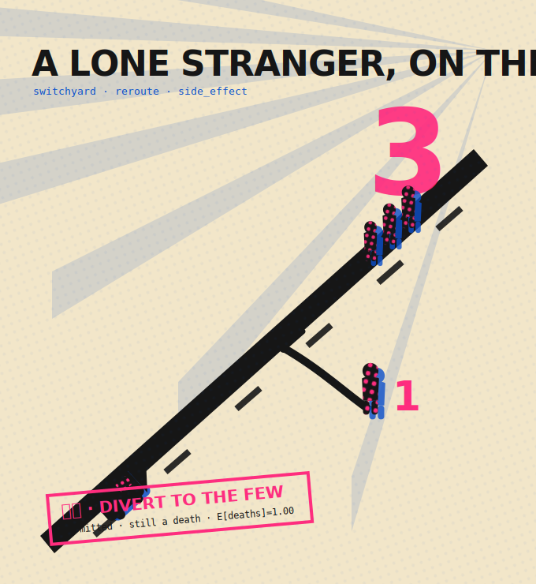 

`reroute` · `side_effect` · **unanimous** · E[deaths]=1 — also [editorial](2026-07-02.editorial.svg) · [animated](2026-07-02.animated.svg) · [hero prompt](2026-07-02.prompt.txt) · `node scripts/gallery.ts 2026-07-02`

---

### 2026-07-01 — *someone you love, on the side track*

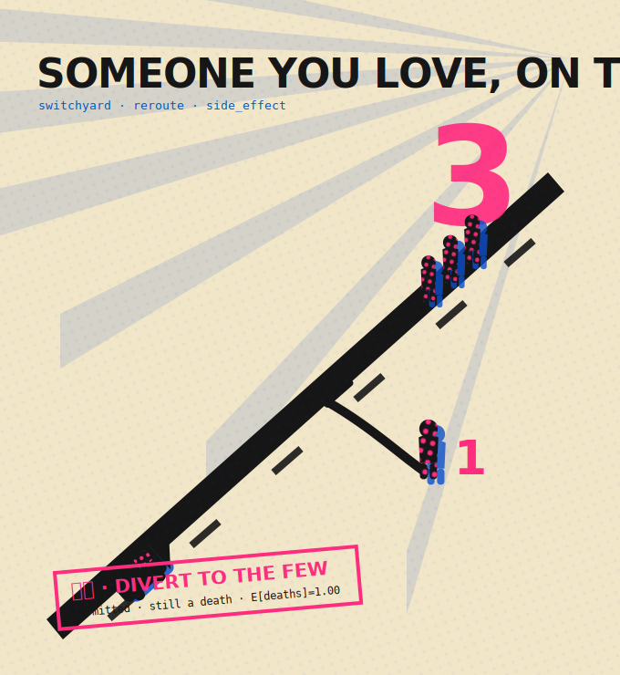 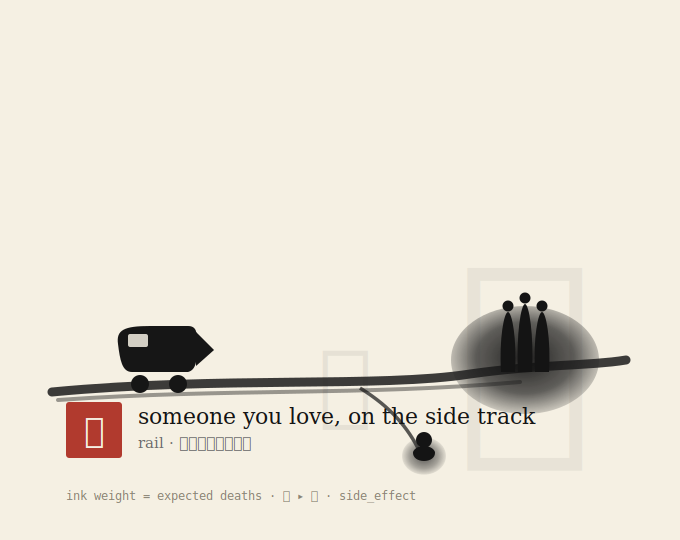

`reroute` · `side_effect` · **contested** · E[deaths]=1 — also [editorial](2026-07-01.editorial.svg) · [animated](2026-07-01.animated.svg) · [hero prompt](2026-07-01.prompt.txt) · `node scripts/gallery.ts 2026-07-01`

---

### 2026-06-30 — *the loop, and a lone stranger*

 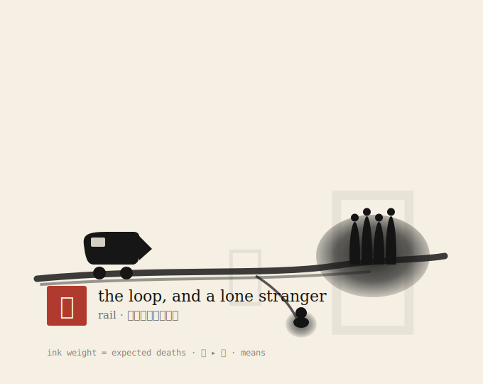

`reroute` · `means` · **contested** · E[deaths]=1 — also [editorial](2026-06-30.editorial.svg) · [animated](2026-06-30.animated.svg) · [hero prompt](2026-06-30.prompt.txt) · `node scripts/gallery.ts 2026-06-30`

---

### 2026-06-29 — *the loop, and a lone stranger*

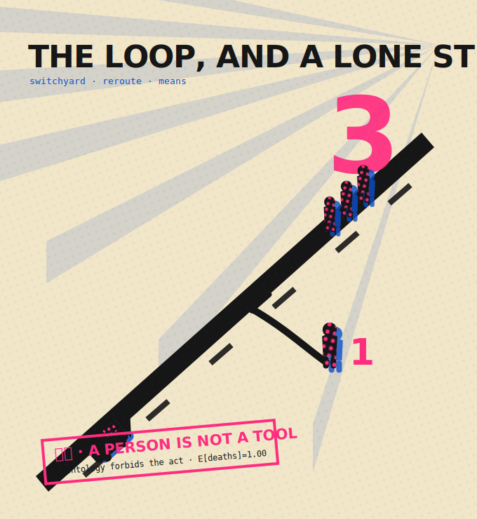 

`reroute` · `means` · **contested** · E[deaths]=1 — also [editorial](2026-06-29.editorial.svg) · [animated](2026-06-29.animated.svg) · [hero prompt](2026-06-29.prompt.txt) · `node scripts/gallery.ts 2026-06-29`

---

### 2026-06-28 — *someone you love, on the side track*

 

`reroute` · `side_effect` · **contested** · E[deaths]=1 — also [editorial](2026-06-28.editorial.svg) · [animated](2026-06-28.animated.svg) · [hero prompt](2026-06-28.prompt.txt) · `node scripts/gallery.ts 2026-06-28`

---

### 2026-06-27 — *the bridge, and the saboteur*

 

`interpose` · `means` · **contested** · E[deaths]=1 — also [editorial](2026-06-27.editorial.svg) · [animated](2026-06-27.animated.svg) · [hero prompt](2026-06-27.prompt.txt) · `node scripts/gallery.ts 2026-06-27`

---

### 2026-06-26 — *the bridge, and a lone stranger*

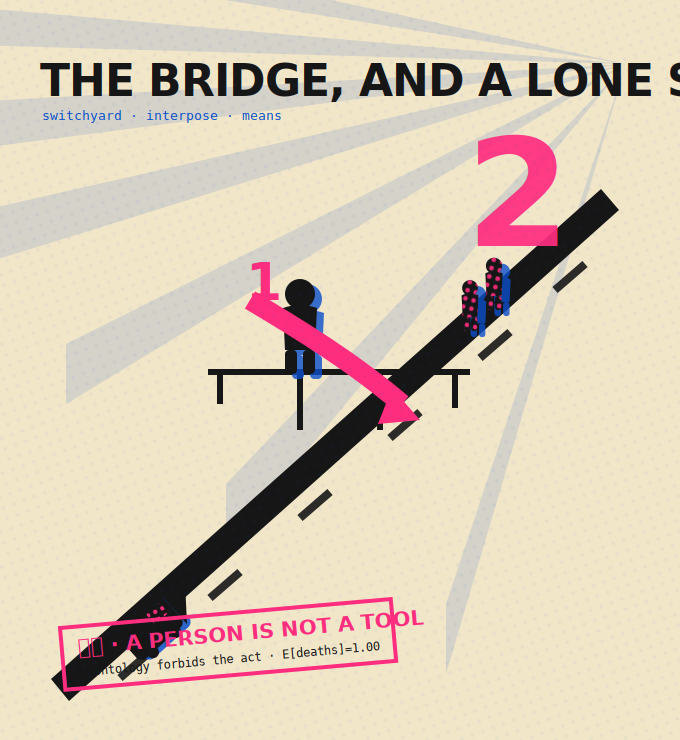 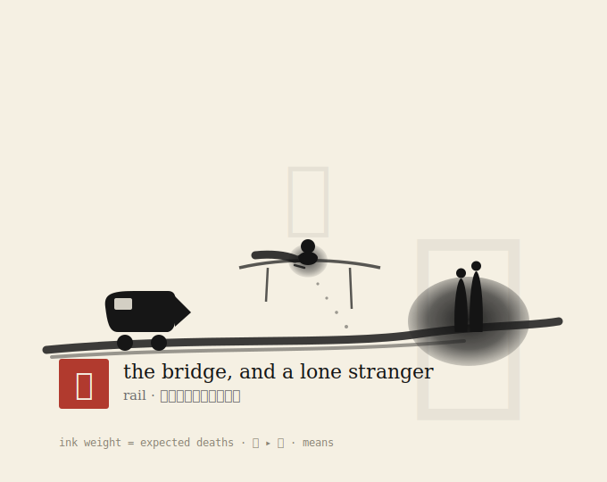

`interpose` · `means` · **contested** · E[deaths]=1 — also [editorial](2026-06-26.editorial.svg) · [animated](2026-06-26.animated.svg) · [hero prompt](2026-06-26.prompt.txt) · `node scripts/gallery.ts 2026-06-26`

---

### 2026-06-25 — *the loop, and someone you love*

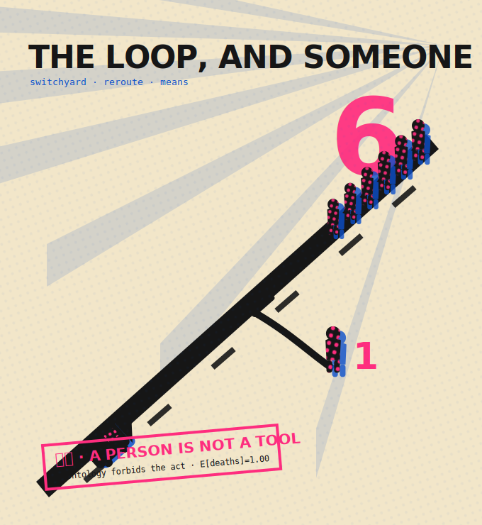 

`reroute` · `means` · **contested** · E[deaths]=1 — also [editorial](2026-06-25.editorial.svg) · [animated](2026-06-25.animated.svg) · [hero prompt](2026-06-25.prompt.txt) · `node scripts/gallery.ts 2026-06-25`

---

### 2026-06-24 — *the loop, and the saboteur*

 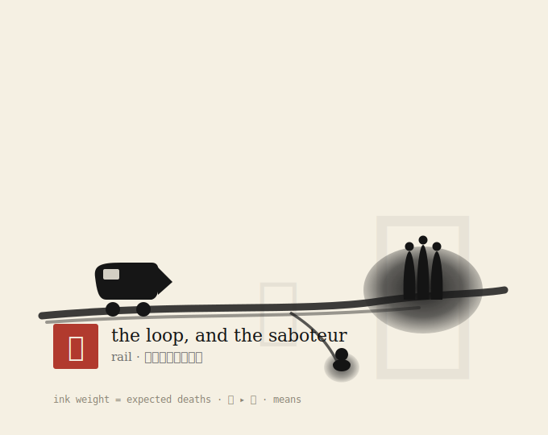

`reroute` · `means` · **unanimous** · E[deaths]=1 — also [editorial](2026-06-24.editorial.svg) · [animated](2026-06-24.animated.svg) · [hero prompt](2026-06-24.prompt.txt) · `node scripts/gallery.ts 2026-06-24`

---

### 2026-06-23 — *a lone stranger, on the side track*

 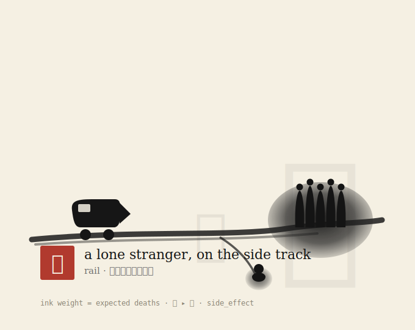

`reroute` · `side_effect` · **unanimous** · E[deaths]=1 — also [editorial](2026-06-23.editorial.svg) · [animated](2026-06-23.animated.svg) · [hero prompt](2026-06-23.prompt.txt) · `node scripts/gallery.ts 2026-06-23`

---

### 2026-06-22 — *someone you love, on the side track*

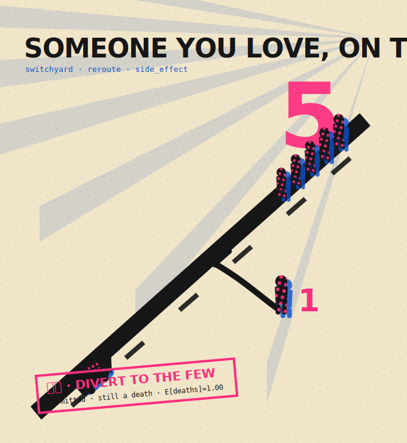 

`reroute` · `side_effect` · **unanimous** · E[deaths]=1 — also [editorial](2026-06-22.editorial.svg) · [animated](2026-06-22.animated.svg) · [hero prompt](2026-06-22.prompt.txt) · `node scripts/gallery.ts 2026-06-22`

---

### 2026-06-21 — *a lone stranger, on the side track*

 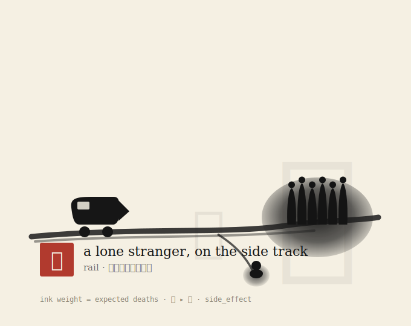

`reroute` · `side_effect` · **unanimous** · E[deaths]=1 — also [editorial](2026-06-21.editorial.svg) · [animated](2026-06-21.animated.svg) · [hero prompt](2026-06-21.prompt.txt) · `node scripts/gallery.ts 2026-06-21`

---

### 2026-06-20 — *the bridge, and the one who chose the risk*

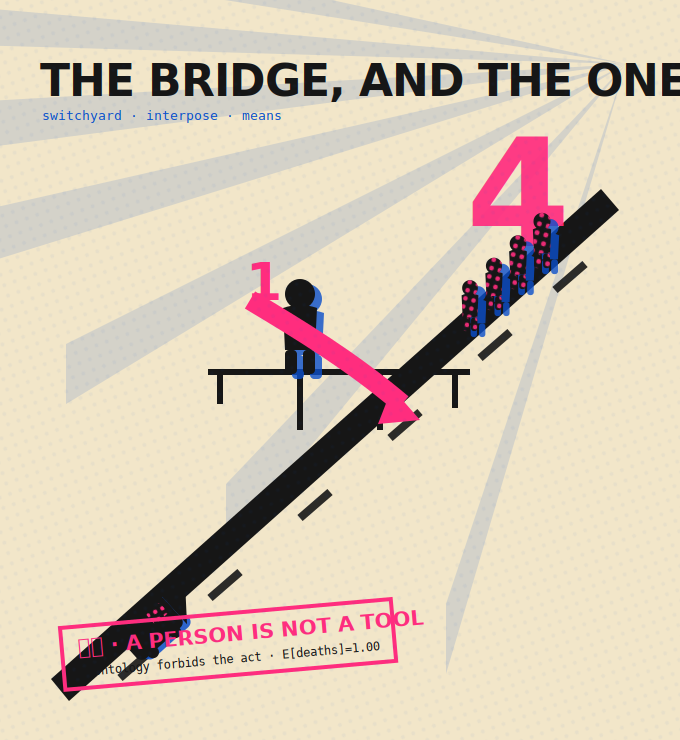 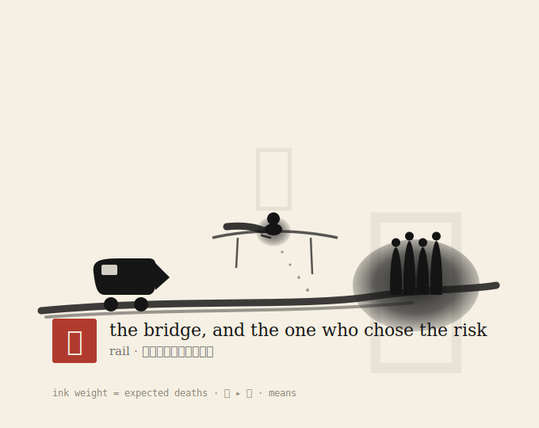

`interpose` · `means` · **contested** · E[deaths]=1 — also [editorial](2026-06-20.editorial.svg) · [animated](2026-06-20.animated.svg) · [hero prompt](2026-06-20.prompt.txt) · `node scripts/gallery.ts 2026-06-20`

---

### 2026-06-19 — *the one who chose the risk, on the side track*

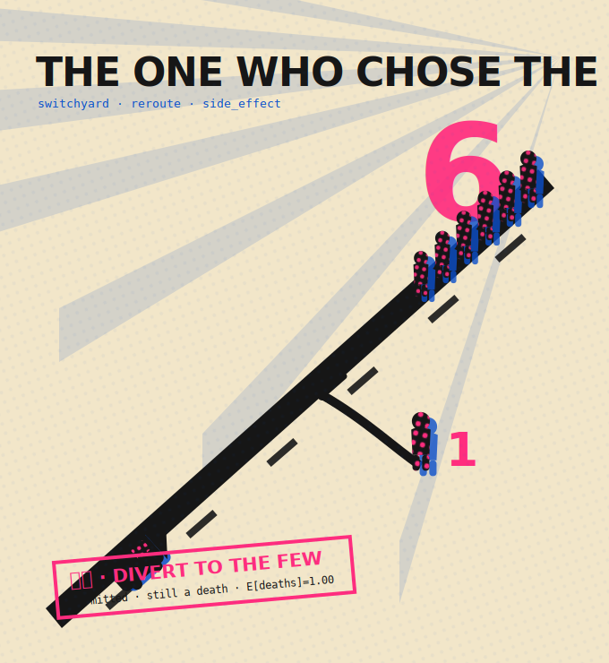 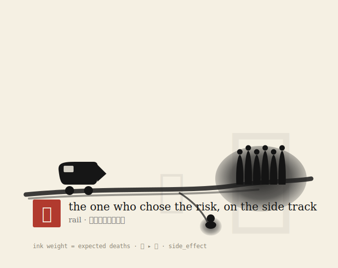

`reroute` · `side_effect` · **unanimous** · E[deaths]=1 — also [editorial](2026-06-19.editorial.svg) · [animated](2026-06-19.animated.svg) · [hero prompt](2026-06-19.prompt.txt) · `node scripts/gallery.ts 2026-06-19`

---

### 2026-06-18 — *the saboteur, on the side track*

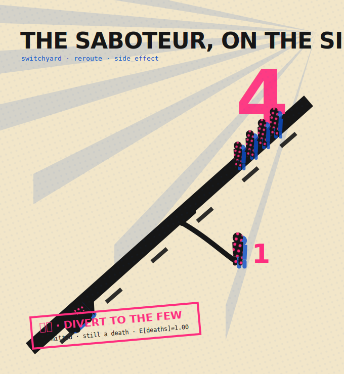 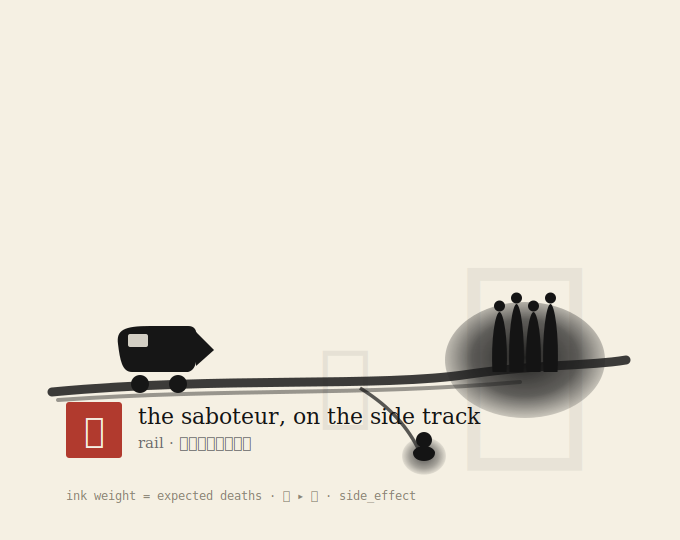

`reroute` · `side_effect` · **unanimous** · E[deaths]=1 — also [editorial](2026-06-18.editorial.svg) · [animated](2026-06-18.animated.svg) · [hero prompt](2026-06-18.prompt.txt) · `node scripts/gallery.ts 2026-06-18`
